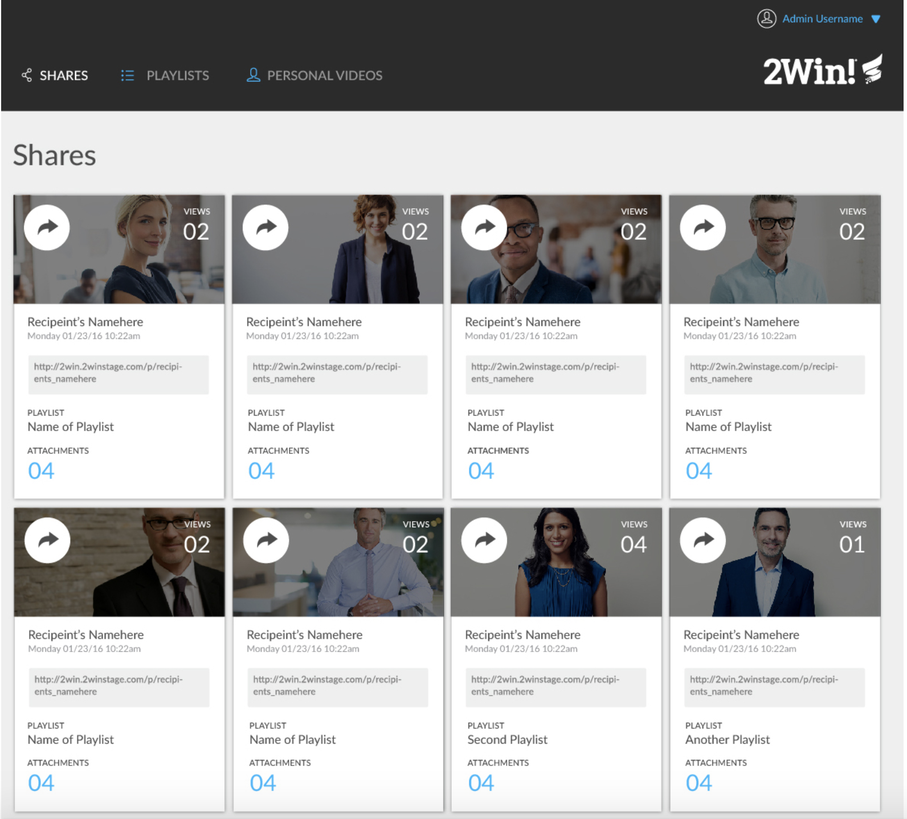
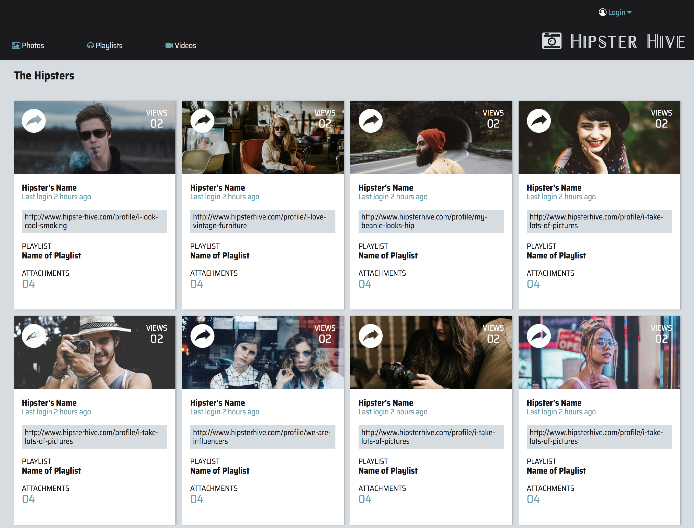

# Static Comp Challenge #2

Our task was to recreate a given comp using only HTML and CSS. We were not provided with any assets, nor native files. We had creative license to change the copy, images, icons, and color palette. 

The following were our requirements: 

* Basic static site setup with index.html and styles.css
* Site must be responsive
* Site must work across Firefox, Safari, and Chrome. 
* Use normalize instead of reset file in CSS

## Original Comp

## My Comp

For the CSS, I used Flexbox to make all the cards align as well as in smaller divs throughout the page. 

## Authors 
* Amanda Tjan [GitHub](https://github.com/soytjan)

## Acknowledgments 

Thank you to all of my fellow cohort mates who helped me refine my layout during the long days and nights at Turing. 